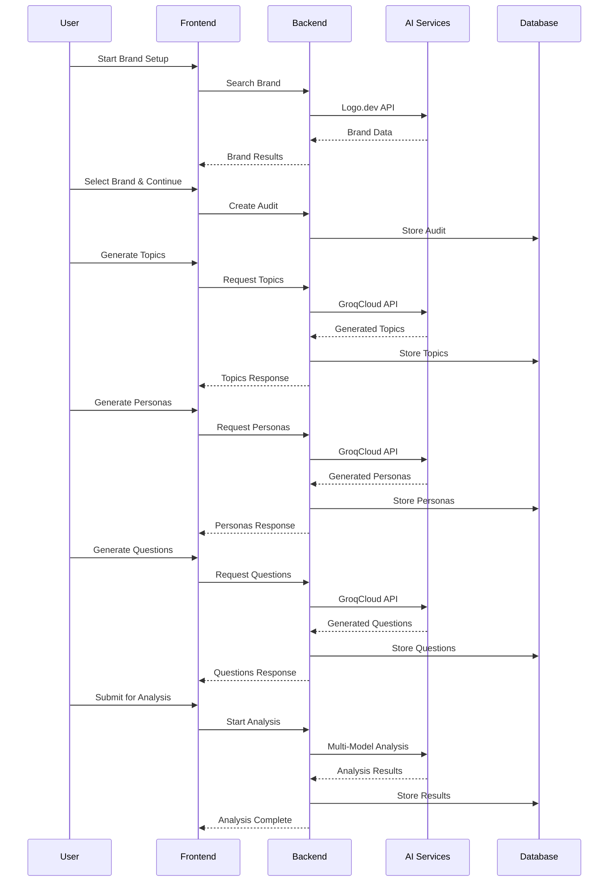

# Tunnelgrid.ai - Comprehensive Codebase Analysis

## 🎯 Project Overview

Tunnelgrid.ai is a sophisticated AI-powered brand analysis platform designed to help businesses understand how their brand appears in AI-generated content. It performs comprehensive audits of brand perception across multiple AI models (ChatGPT, Claude, Perplexity) and provides actionable insights for improving brand visibility in the AI era.

## 🏗️ Architecture Overview

The platform follows a modern microservices architecture with clear separation between frontend and backend:

```
Frontend (React + TypeScript + Vite)
        ↓ (REST API)
Backend (FastAPI + Python)
        ↓ (External APIs)
┌─────────────────────────────────────────┐
│ Logo.dev │ GroqCloud │ OpenAI │ Supabase │
└─────────────────────────────────────────┘
```

### Technology Stack

**Frontend:**
- React 18 with TypeScript
- Vite for build tooling
- Tailwind CSS + Radix UI components
- React Router for navigation
- TanStack Query for state management
- Supabase client for authentication

**Backend:**
- FastAPI (Python) for REST API
- Uvicorn ASGI server
- Pydantic for data validation
- Supabase for database operations
- Rate limiting with SlowAPI
- CORS middleware for frontend access

**External Integrations:**
- **Logo.dev API**: Brand search and company data
- **GroqCloud API**: AI-powered content generation
- **OpenAI API**: Advanced AI analysis and embeddings
- **Supabase PostgreSQL**: Database and authentication

## 📊 Backend Analysis

### Core Structure

```
backend/
├── app/
│   ├── core/
│   │   ├── config.py          # Environment & API configurations
│   │   └── database.py        # Supabase client management
│   ├── models/
│   │   ├── brands.py          # Brand-related data models
│   │   ├── personas.py        # Customer persona models
│   │   ├── questions.py       # Question generation models
│   │   ├── analysis.py        # Analysis job models
│   │   ├── audits.py          # Audit management models
│   │   └── common.py          # Shared utility models
│   ├── routes/
│   │   ├── brands.py          # Brand search & management
│   │   ├── topics.py          # AI topic generation
│   │   ├── personas.py        # Customer persona creation
│   │   ├── questions.py       # Question generation
│   │   ├── audits.py          # Audit lifecycle management
│   │   ├── analysis.py        # AI analysis orchestration
│   │   └── studies.py         # Study management
│   ├── services/
│   │   ├── ai_analysis.py     # OpenAI integration service
│   │   └── websearch_service.py
│   └── main.py                # FastAPI application setup
```

### API Endpoints Overview

| Endpoint | Purpose | Key Features |
|----------|---------|--------------|
| `/api/brands` | Brand search via Logo.dev | Search, create, analyze brands |
| `/api/topics` | AI topic generation | GroqCloud integration, fallback topics |
| `/api/personas` | Customer persona creation | AI-generated personas with demographics |
| `/api/questions` | Question generation | Persona-specific question creation |
| `/api/audits` | Audit management | Track analysis progress and results |
| `/api/analysis` | AI analysis orchestration | Multi-model analysis coordination |
| `/api/studies` | Study management | User study tracking and progress |

### Key Backend Features

1. **Secure API Key Management**: All external API keys stored server-side
2. **Rate Limiting**: Request throttling to prevent abuse
3. **Comprehensive Error Handling**: Graceful fallbacks and error responses
4. **Data Validation**: Pydantic models ensure data integrity
5. **Background Jobs**: Async processing for long-running analysis
6. **Health Monitoring**: Service status checks and diagnostics

## 🎨 Frontend Analysis

### Component Architecture

```
frontend/src/
├── components/
│   ├── setup/                 # Brand setup wizard
│   │   ├── BrandSetupWizard.tsx
│   │   ├── hooks/useWizardState.ts
│   │   └── steps/             # Individual wizard steps
│   ├── landing/               # Landing page components
│   ├── dashboard/             # Dashboard components
│   ├── report/                # Report visualization
│   ├── layout/                # App layout components
│   └── ui/                    # Reusable UI components (shadcn/ui)
├── pages/                     # Route components
├── services/                  # API integration services
├── contexts/                  # React context providers
├── hooks/                     # Custom React hooks
└── types/                     # TypeScript type definitions
```

### Frontend Services Layer

| Service | Purpose | Backend Integration |
|---------|---------|-------------------|
| `groqService.ts` | Topics generation | `/api/topics/*` |
| `personasService.ts` | Persona management | `/api/personas/*` |
| `questionService.ts` | Question generation | `/api/questions/*` |
| `auditService.ts` | Audit operations | `/api/audits/*` |
| `analysisService.ts` | Analysis coordination | `/api/analysis/*` |
| `studyService.ts` | Study management | `/api/studies/*` |

### State Management

The application uses a sophisticated state management approach:

1. **Local Component State**: React useState for component-specific data
2. **Wizard State Hook**: Custom `useWizardState` for multi-step form data
3. **React Query**: Server state management and caching
4. **Context Providers**: Authentication and global app state
5. **Progress Persistence**: Study progress saved to database

## 🔄 Key User Flows

### 1. Brand Setup Wizard Flow


**Steps Breakdown:**

1. **Brand Search**: User searches for brand using Logo.dev API
2. **Brand Info**: Collects brand details and creates audit record
3. **Topics**: AI generates relevant topics for the brand/product
4. **Personas**: Creates customer personas with demographics and motivations
5. **Questions**: Generates persona-specific questions for AI analysis
6. **Review**: User reviews all generated content before submission
7. **Analysis**: Backend orchestrates multi-model AI analysis
8. **Results**: Comprehensive report with visibility metrics

### 2. Data Flow Architecture



## 🚀 Key Features & Capabilities

### 1. Brand Analysis & Intelligence
- **Multi-Model AI Analysis**: Queries ChatGPT, Claude, and Perplexity
- **Sentiment Analysis**: Positive, neutral, negative brand perception
- **Visibility Scoring**: Proprietary brand visibility metrics
- **Competitor Comparison**: Side-by-side brand analysis
- **Trend Tracking**: Historical visibility trends over time

### 2. AI-Powered Content Generation
- **Smart Topic Generation**: Industry-relevant topics using GroqCloud
- **Customer Persona Creation**: Detailed personas with demographics
- **Question Generation**: Persona-specific research questions
- **Fallback Systems**: Offline capability with predefined content
- **Content Customization**: User-editable AI-generated content

### 3. Comprehensive Reporting
- **Interactive Dashboards**: React-based visualization components
- **Brand Visibility Cards**: Circular progress indicators and metrics
- **Topic Visibility Matrix**: Heat map of persona-topic relationships
- **Model Comparison**: Cross-platform AI model analysis
- **Source Analysis**: Citation and reference tracking
- **Export Capabilities**: Downloadable reports and data

### 4. User Experience Features
- **Progressive Wizard**: Step-by-step guided setup process
- **Real-time Progress**: Live updates during analysis
- **Study Management**: Save and resume analysis projects
- **Authentication**: Supabase-powered user management
- **Responsive Design**: Mobile-friendly interface
- **Error Handling**: Graceful degradation and user feedback

### 5. Developer Experience
- **Type Safety**: Full TypeScript coverage
- **API Documentation**: Automatic OpenAPI/Swagger docs
- **Testing Suite**: Comprehensive test coverage
- **Development Tools**: Hot reload, linting, formatting
- **Deployment Ready**: Containerizable and cloud-ready

## 🔐 Security & Performance

### Security Features
- **API Key Protection**: All external API keys server-side only
- **Rate Limiting**: Request throttling and abuse prevention
- **Input Validation**: Pydantic models and sanitization
- **CORS Configuration**: Secure cross-origin requests
- **Authentication**: Supabase Auth integration
- **Environment Isolation**: Separate dev/prod configurations

### Performance Optimizations
- **Async Processing**: Background jobs for long-running tasks
- **Caching Strategy**: React Query for client-side caching
- **Database Optimization**: Efficient Supabase queries
- **Lazy Loading**: Component and route code splitting
- **Error Boundaries**: Graceful error handling
- **Progress Persistence**: Resume interrupted workflows

## 📈 Current Status & Capabilities

### ✅ Completed Features
- Full brand search and analysis pipeline
- AI-powered content generation (topics, personas, questions)
- Multi-step wizard with progress persistence
- Comprehensive reporting dashboard
- Study management system
- Authentication and user management
- API documentation and testing

### 🔄 Active Components
- Backend server running on port 8000
- Frontend development server integration
- Database connections and API integrations
- Real-time analysis processing
- User authentication flows

### 🎯 Key Strengths
1. **Modular Architecture**: Clean separation of concerns
2. **Scalable Design**: Easy to add new AI models or features
3. **User-Centric**: Intuitive wizard-based workflow
4. **Enterprise-Ready**: Security, monitoring, and error handling
5. **Developer-Friendly**: Comprehensive documentation and tooling

This platform represents a sophisticated, production-ready application for AI-powered brand analysis with modern web technologies and best practices throughout the stack.